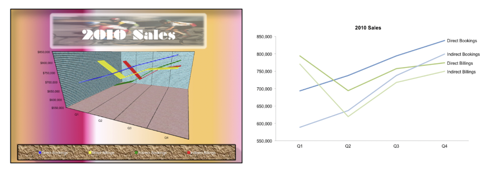
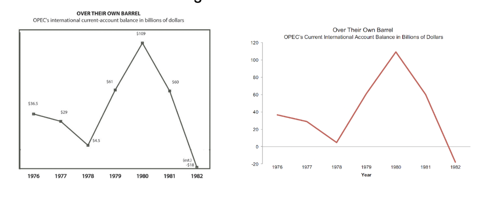
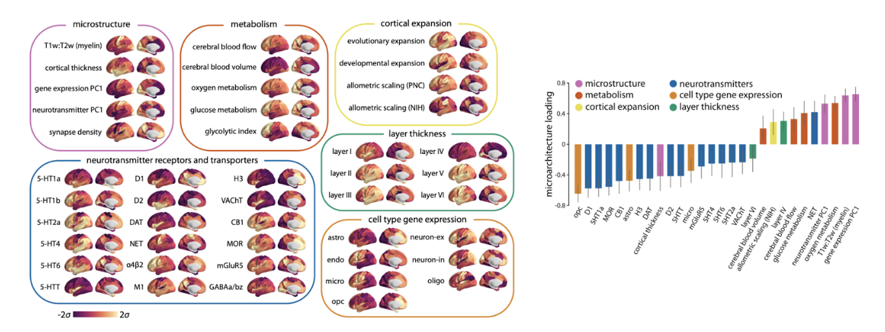
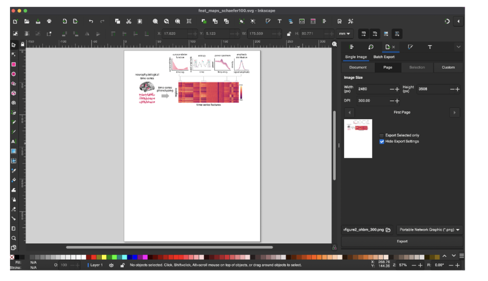

# PennLINC Figure Making Guide

# FIGURE DESIGN PRINCIPLES

Summarized from slides by Golia Shafiei, Ph.D. (based on the book "The Visual Display of Quantitative Information" by Edward R. Tufte [1])

- There is no single way to make an effective figure—depends on data type, number audience, analysis, and other factors
- “Essentially, statistical graphics are instruments to help people reason about quantitative information.” - Edward Tufte

**Key guiding principles can help tailor figures across types**

1. Above all else, *show the data*
2. Reduce “chart junk” — borders, shadows, 3-D versions when 2-D would suffice, grid lines, tick marks
3. Maximize data-to-ink ratio and erase redundant data-ink. **EXAMPLE** of high data-ink ratio (and chart junk) on the left, and low data-ink ratio on the right:
4. Create the simplest graph that conveys the information you want to present
5. Don’t overcomplicate figures—they are tools for understanding. Every bit of ink requires a reason.

**Additional Tips, Tricks, and Recommendations**

1. Use color-blind friendly palettes when possible, especially ones that work in both color and grey scale.
    1. Online resources for simulating colorblindeness can help with this, or fully de-saturating plots within Illustrator, In Design, or other tools.
    2. Avoid maps with uneven color gradients (e.g., Jet)
2. Avoid pie charts—tables are almost always better
3. Use *meaningful baseline numbers* for axes to avoid distorting data interpretation. **EXAMPLE:** lack of meaningful baseline numbers on the left.

 

 
1. Use visual variables (color, shape, shade) only to identify data variation
2. Be consistent with visual variables—e.g., don’t use different colors to represent the same kinds of data. **EXAMPLE:** visual variables can help readers interpret figures when used appropriately.

(figures from [2])
 
 
1. Use a page layout to decide if the figure is a 1-column (full page width) figure or a two column (half-page width) figure. **Example:** A full-page width figure.

(figures from [2])

1. Limit the number of fonts and font sizes in the figure. Check journal guidelines and match the figure font to the font the journal prints in.
2. Most figure-specific changes can be implemented in code, but In Design and/or Illustrator can be helpful for finishing touches.
3. Shared figure-plotting code can simplify incorporating these recommendations!
   - [R code](https://github.com/PennLINC/figure_formatting/tree/main/R)
   - [Python code](https://github.com/PennLINC/figure_formatting/tree/main/Python)

# PENNLINC SPECIFIC GUIDELINES

**Core visual default parameters**

- **Font:** sans-serif (e.g., Arial/Helvetica). Axis labels should be the same font within and across figures. Check Journal guidelines, which may have font requirements.
- **Sizes:** title 9–10 pt, axes 8–9 pt, tick labels 7–8 pt, legend 7–8 pt.
- **Titles**: be consistent in use of titles in figures across manuscript. Decide if all or none of your figures will have titles.
- **Lines/markers:** line width 1.0–1.25 pt; tick marks 0.5–0.75 pt; markers sized so 95% CIs are visible (e.g., s=20–30 in scatter).
- **Despine plot:** Remove the upper and right spines
    - In R: ggplot(df, aes(x, y)) + geom_point() + theme_classic()
    - In Python: sns.despine(top=True, right=True)
- **Grids:** off by default.
- **Color:** use perceptually uniform palettes. Sequential (e.g., viridis) for magnitude; diverging (blue–white–red or purple–white–orange) for signed effects around 0. Avoid rainbow/“jet”. Provide a grayscale-legible alternative when possible.
    - Make coloring consistent across (sub)figures (e.g. if Projection tracts are blue in Figure 1, they should be blue in all other figures).
- **Units:** always on axes (e.g., “FD (mm)”, “z-FC”).
- **Abbreviations:** define once in caption or panel label.
- **Panel labels:** A, B, C… in the upper-left of each panel, bold, 9–10 pt, inset not overlapping data.
- **Legends:** only encode what’s not obvious from labels; never duplicate axis titles.
- **Ticks:** 3–6 ticks per axis; use human-readable numbers; avoid scientific notation unless unavoidable.

**Statistics**

- Always report an **estimate + uncertainty** (95% CI or compatible interval).
- Show **raw or semi-raw data** where feasible (e.g., dotplots/violin with quartiles) rather than only summary bars.
- **Effect sizes, not just p:** standardized (β, Cohen’s d) or interpretable raw units.
- **Multiplicity:** if thresholds are shown, specify control (FDR q, FWE α) and the family tested.

**Captions**

- **Approach:** key design/metric/model.
- Include information about sample, if applicable (what sample/dataset, what is the sample size *n*)
- **Evidence:** the estimate(s) with CI and n.
- The figure should be understandable from the figure and its caption alone, without the accompanying text.

**Export & file handling**

- **Preferred format:** vector (PDF/SVG) for line/axis figures. If it must be PNG due to journal or software constraints, save at high resolution (e.g., 300 dpi).
- **Is it lines/text/shapes?** → Vector (PDF for journals, SVG for web).
- **Is it an image/brain map/heatmap?** → Raster (PNG/TIFF) at the final print width and appropriate DPI (≈300 dpi for photos/heatmaps, up to 600 dpi for fine details).
- **Width targets:** prepare at the intended journal column width; check legibility at 85–90 mm (single column) and 180–185 mm (double).

**Pre-submission figure checklist**

- One clear claim per figure; panels ordered logically.
- Axes labeled with units; readable at single-column width.
- Estimates with 95% CIs; n’s included; multiplicity control stated.
- Colorblind-safe palette; passes grayscale print test.
- For brain maps: orientation, space, colorbar with labeled endpoints, threshold method stated; coordinates provided.
- Figure is reproducible from code; output is vector or 300–600 dpi raster; fonts embedded.

**Plotting on the brain / surface**

- If you plot cortical data, make sure the midbrain is masked
- If the data you plot has units, make sure the colorbar limits are meaningful. E.g. if you plot change (delta) and use a binary colormap - make sure the ‘0’ is white / the colormap should be symmetric and diverge around 0
    - And label the endpoints
- Show medial and lateral views (ventral / dorsal if needed)
- If you show 2D slices, include labels (L / R, axial, sagittal etc.)
- Think about surface inflation - do you want to show effects in sulci and hidden regions like the insula?

**Tools for plotting on the surface**

*Python*

- Nilearn (https://nilearn.github.io/stable/plotting/index.html)
- BrainSpace (https://brainspace.readthedocs.io/en/latest/pages/getting_started.html)
- ENIGMAToolbox ([https://enigma-toolbox.readthedocs.io/en/latest/pages/12.visualization/](https://enigma-toolbox.readthedocs.io/en/latest/pages/12.visualization/))

*R*

- ggseg (https://github.com/ggseg/ggseg)

**RESOURCES**

Colormaps

- Coblis — Color Blindness Simulator: [https://www.color-blindness.com/coblis-color-blindness-simulator/](https://www.color-blindness.com/coblis-color-blindness-simulator/)
- Crameri / Scientific colormaps: [https://www.fabiocrameri.ch/colourmaps/](https://www.fabiocrameri.ch/colourmaps/)
- MyColor: [https://mycolor.space/?hex=%23845EC2&sub=1](https://mycolor.space/?hex=%23845EC2&sub=1) (finds matching colormap for one color)
- Seaborn: [https://seaborn.pydata.org/tutorial/color_palettes.html](https://seaborn.pydata.org/tutorial/color_palettes.html)

Stock images

- [unsplash.com](http://unsplash.com/)
- [pixabay.com](http://pixabay.com/)
- [freepik.com](http://freepik.com/)
- Adobe Stock (with standard license)

# HOW TO IMPLEMENT THIS IN A REPRODUCIBLE WAY:

- Rather than manual tweaking or guessing figure sizes over and over, we can use a few functions that will enforce figure formatting for us. These functions are contained in [figure_formatting.R](https://github.com/PennLINC/figure_formatting/blob/main/R/figure_formatting.R) and [figure_formatting.py](https://github.com/PennLINC/figure_formatting/blob/main/Python/figure_formatting.py). Specifically, here’s what it does: 
    - takes in predefined final figure size in mm: this is the size you’ve pre-allocated in InDesign for this plot
    - enforces consistent font type and font size, as well as plot size in mm
- IMPORTANT NOTE:
    - Make sure that you import this figure “from scratch” into InDesign - meaning, don’t just update the link of a previously existing figure. If you do that, the figure gets resized by InDesign (even if you don’t autoscale and fit the frame to content, it doesn’t work).
    - Instead, delete the existing plot in the InDesign page, and re-import the new figure using the “Start with image” → “Import File”. Another option is to simply drag and drop the newly made plot. This will place it in the page with the exact figure dimensions we specified in the Python script.
- Also, when saving this out, it might throw a warning that a font wasn’t found for some plots in the page. Just click ok and ignore that! It will save just fine.
- You can reference our PennLINC InDesign and Illustrator [templates](https://github.com/PennLINC/figure_formatting/tree/main/templates) to help lay out your panels:
