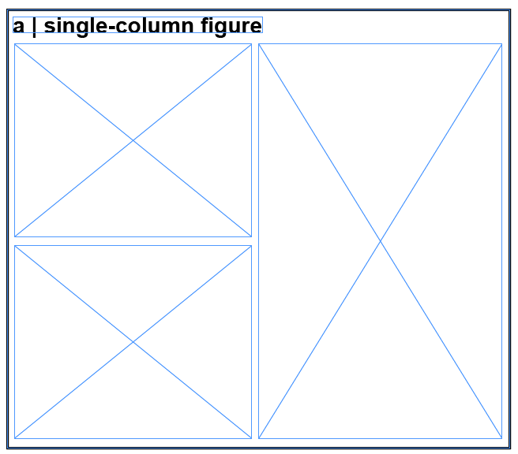
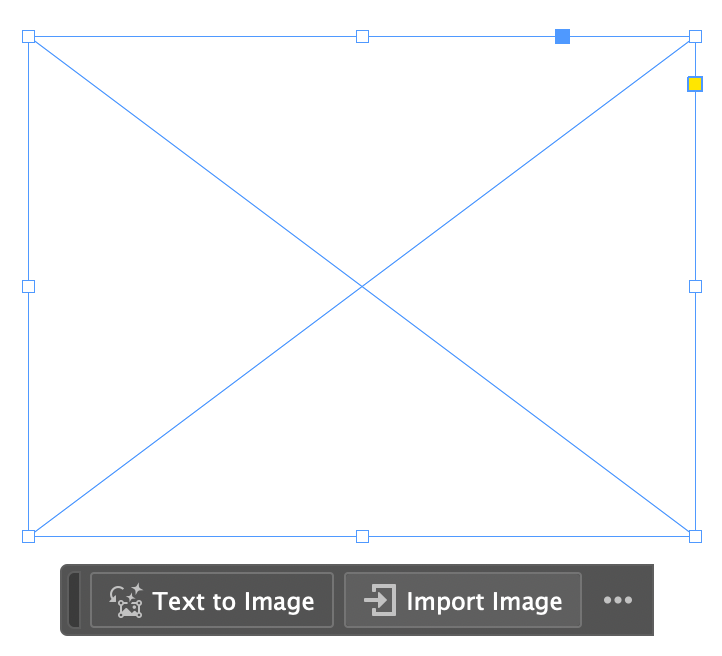
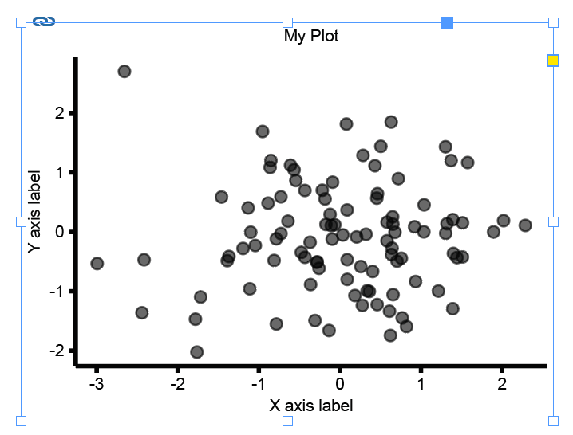

# PennLINC Figure Making Guide

<div class="toc-wrapper" style="position: fixed; left: 0; top: 0; width: 250px; height: 100vh; overflow-y: auto; padding: 20px; background: #f5f5f5; border-right: 1px solid #ddd; z-index: 1000;">
<strong>Table of Contents</strong>
<ul style="list-style: none; padding-left: 20px; margin: 10px 0;">
<li><a href="#figure-design-principles">Figure Design Principles</a></li>
<li><a href="#pennlinc-specific-guidelines">PennLINC Specific Guidelines</a>
  <ul style="list-style: none; padding-left: 15px; margin: 5px 0;">
  <li><a href="#core-visual-default-parameters">Core Visual Parameters</a></li>
  <li><a href="#statistics">Statistics</a></li>
  <li><a href="#captions">Captions</a></li>
  <li><a href="#export--file-handling">Export & File Handling</a></li>
  <li><a href="#pre-submission-figure-checklist">Pre-submission Checklist</a></li>
  <li><a href="#plotting-on-the-brain--surface">Plotting on the Brain</a>
    <ul style="list-style: none; padding-left: 15px; margin: 5px 0;">
    <li><a href="#tools-for-plotting-on-the-brain-surface">Tools for Plotting</a></li>
    </ul>
  </li>
  <li><a href="#resources">Resources</a></li>
  </ul>
</li>
<li><a href="#how-to-implement-this-in-a-reproducible-way-figure-formatting-utilities">Figure Formatting Utilities</a>
  <ul style="list-style: none; padding-left: 15px; margin: 5px 0;">
  <li><a href="#the-problem">The Problem</a></li>
  <li><a href="#the-solution">The Solution</a></li>
  <li><a href="#requirements">Requirements</a></li>
  <li><a href="#workflow">Workflow</a>
    <ul style="list-style: none; padding-left: 15px; margin: 5px 0;">
    <li><a href="#1-create-a-figure-layout">1. Create a figure layout</a></li>
    <li><a href="#2-generate-figures">2. Generate figures</a>
      <ul style="list-style: none; padding-left: 15px; margin: 5px 0;">
      <li><a href="#python-">Python</a></li>
      <li><a href="#r-">R</a></li>
      </ul>
    </li>
    <li><a href="#3-load-the-plot-into-the-figure-layout">3. Load the plot</a></li>
    </ul>
  </li>
  </ul>
</li>
<li><a href="#questions-and-troubleshooting">Questions and Troubleshooting</a></li>
<li><a href="#references">References</a></li>
</ul>
</div>

In this tutorial, we'll go over some general figure design principles, then outline more specific guidelines for PennLINC. To make it convenient, reproducible and easy, we also go over a workflow and readily available scripts that can format all your plots (along with font type and size) automatically for you in Python and R. 

Let's dive in!

# FIGURE DESIGN PRINCIPLES

Summarized from slides by Golia Shafiei, Ph.D. (based on the book "The Visual Display of Quantitative Information" by Edward R. Tufte [1])

- There is no single way to make an effective figure—depends on data type, number audience, analysis, and other factors
- “Essentially, statistical graphics are instruments to help people reason about quantitative information.” - Edward Tufte

**Key guiding principles can help tailor figures across types**

1. Above all else, *show the data*
2. Reduce “chart junk” — borders, shadows, 3-D versions when 2-D would suffice, grid lines, tick marks
3. Maximize data-to-ink ratio and erase redundant data-ink. **EXAMPLE** of high data-ink ratio (and chart junk) on the left, and low data-ink ratio on the right:
4. Create the simplest graph that conveys the information you want to present
5. Don’t overcomplicate figures—they are tools for understanding. Every bit of ink requires a reason.


(figures from [2])

**Additional Tips, Tricks, and Recommendations**

1. Use color-blind friendly palettes when possible, especially ones that work in both color and grey scale.
    1. Online resources for simulating colorblindeness can help with this, or fully de-saturating plots within Illustrator, In Design, or other tools.
    2. Avoid maps with uneven color gradients (e.g., Jet)
2. Avoid pie charts—tables are almost always better
3. Use *meaningful baseline numbers* for axes to avoid distorting data interpretation. **EXAMPLE:** lack of meaningful baseline numbers on the left.

 

(figures from [2])
 
1. Use visual variables (color, shape, shade) only to identify data variation
2. Be consistent with visual variables—e.g., don’t use different colors to represent the same kinds of data. **EXAMPLE:** visual variables can help readers interpret figures when used appropriately.


(figures from [3])
 
 
1. Use a page layout to decide if the figure is a 1-column (full page width) figure or a two column (half-page width) figure. **Example:** A full-page width figure.


(figures from [3])

1. Limit the number of fonts and font sizes in the figure. Check journal guidelines and match the figure font to the font the journal prints in.
2. Most figure-specific changes can be implemented in code, but In Design and/or Illustrator can be helpful for finishing touches.
3. Shared figure-plotting code can simplify incorporating these recommendations!
   - [R code](https://github.com/PennLINC/figure_formatting/tree/main/R)
   - [Python code](https://github.com/PennLINC/figure_formatting/tree/main/Python)

# PENNLINC SPECIFIC GUIDELINES

## Core visual default parameters**

- **Font:** sans-serif (e.g., Arial/Helvetica). Axis labels should be the same font within and across figures. Check Journal guidelines, which may have font requirements.
- **Sizes:** title 9–10 pt, axes 8–9 pt, tick labels 7–8 pt, legend 7–8 pt.
- **Titles**: be consistent in use of titles in figures across manuscript. Decide if all or none of your figures will have titles.
- **Lines/markers:** line width 1.0–1.25 pt; tick marks 0.5–0.75 pt; markers sized so 95% CIs are visible (e.g., s=20–30 in scatter).
- **Despine plot:** Remove the upper and right spines
    - In R: ggplot(df, aes(x, y)) + geom_point() + theme_classic()
    - In Python: sns.despine(top=True, right=True)
- **Grids:** off by default.
- **Color:** use perceptually uniform palettes. Sequential (e.g., viridis) for magnitude; diverging (blue–white–red or purple–white–orange) for signed effects around 0. Avoid rainbow/“jet”. Provide a grayscale-legible alternative when possible.
    - Make coloring consistent across (sub)figures (e.g. if Projection tracts are blue in Figure 1, they should be blue in all other figures).
- **Units:** always on axes (e.g., “FD (mm)”, “z-FC”).
- **Abbreviations:** define once in caption or panel label.
- **Panel labels:** A, B, C… in the upper-left of each panel, bold, 9–10 pt, inset not overlapping data.
- **Legends:** only encode what’s not obvious from labels; never duplicate axis titles.
- **Ticks:** 3–6 ticks per axis; use human-readable numbers; avoid scientific notation unless unavoidable.

## Statistics

- Always report an **estimate + uncertainty** (95% CI or compatible interval).
- Show **raw or semi-raw data** where feasible (e.g., dotplots/violin with quartiles) rather than only summary bars.
- **Effect sizes, not just p:** standardized (β, Cohen’s d) or interpretable raw units.
- **Multiplicity:** if thresholds are shown, specify control (FDR q, FWE α) and the family tested.

## Captions

- **Approach:** key design/metric/model.
- Include information about sample, if applicable (what sample/dataset, what is the sample size *n*)
- **Evidence:** the estimate(s) with CI and n.
- The figure should be understandable from the figure and its caption alone, without the accompanying text.

## Export & file handling

- **Preferred format:** vector (PDF/SVG) for line/axis figures. If it must be PNG due to journal or software constraints, save at high resolution (e.g., 300 dpi).
- **Is it lines/text/shapes?** → Vector (PDF for journals, SVG for web).
- **Is it an image/brain map/heatmap?** → Raster (PNG/TIFF) at the final print width and appropriate DPI (≈300 dpi for photos/heatmaps, up to 600 dpi for fine details).
- **Width targets:** prepare at the intended journal column width; check legibility at 85–90 mm (single column) and 180–185 mm (double).

## Pre-submission figure checklist

- One clear claim per figure; panels ordered logically.
- Axes labeled with units; readable at single-column width.
- Estimates with 95% CIs; n’s included; multiplicity control stated.
- Colorblind-safe palette; passes grayscale print test.
- For brain maps: orientation, space, colorbar with labeled endpoints, threshold method stated; coordinates provided.
- Figure is reproducible from code; output is vector or 300–600 dpi raster; fonts embedded.

## Plotting on the brain / surface

- If you plot cortical data, make sure the midbrain is masked
- If the data you plot has units, make sure the colorbar limits are meaningful. E.g. if you plot change (delta) and use a binary colormap - make sure the ‘0’ is white / the colormap should be symmetric and diverge around 0
    - And label the endpoints
- Show medial and lateral views (ventral / dorsal if needed)
- If you show 2D slices, include labels (L / R, axial, sagittal etc.)
- Think about surface inflation - do you want to show effects in sulci and hidden regions like the insula?

### Tools for plotting on the brain surface

*Python*

- Nilearn (https://nilearn.github.io/stable/plotting/index.html)
- BrainSpace (https://brainspace.readthedocs.io/en/latest/pages/getting_started.html)
- ENIGMAToolbox ([https://enigma-toolbox.readthedocs.io/en/latest/pages/12.visualization/](https://enigma-toolbox.readthedocs.io/en/latest/pages/12.visualization/))

*R*

- ggseg (https://github.com/ggseg/ggseg)

## RESOURCES

*Colormaps*

- Coblis — Color Blindness Simulator: [https://www.color-blindness.com/coblis-color-blindness-simulator/](https://www.color-blindness.com/coblis-color-blindness-simulator/)
- Crameri / Scientific colormaps: [https://www.fabiocrameri.ch/colourmaps/](https://www.fabiocrameri.ch/colourmaps/)
- MyColor: [https://mycolor.space/?hex=%23845EC2&sub=1](https://mycolor.space/?hex=%23845EC2&sub=1) (finds matching colormap for one color)
- Seaborn: [https://seaborn.pydata.org/tutorial/color_palettes.html](https://seaborn.pydata.org/tutorial/color_palettes.html)

*Stock images*

- [unsplash.com](http://unsplash.com/)
- [pixabay.com](http://pixabay.com/)
- [freepik.com](http://freepik.com/)
- Adobe Stock (with standard license)


# HOW TO IMPLEMENT THIS IN A REPRODUCIBLE WAY: FIGURE FORMATTING UTILITIES

## The problem

Pretty much all researchers will face it at some point: you need to create a multipanel figure for a manuscript. In doing so, you might first generate various plots that you then import into a software tool like InDesign or Illustrator. This is especially true when your panels aren’t all aligned, or contain various file types: maybe some are svg files containing graphs, some are png files containing brain images, etc. 

In the process of creating this multipanel figure, you typically end up needing to resize and adjust so that all panels are arranged the way you want. However, this process also rescales the font size of the plots, leading to **panels with inconsistent font sizes** (yikes!). 

This means you then need to manually tweak font sizes after the fact in InDesign (or Illustrator), or do a lot of trial and error when specifying plot sizes in Python or R to finally get a plot that has the right font size when imported into InDesign — not ideal  🫠.

## The solution

Rather than manual tweaking or guessing figure sizes over and over, we can use a few functions that will enforce figure formatting for us. 

The [figure formatting repository](https://github.com/PennLINC/figure_formatting) contains scripts for creating figures with exact physical dimensions in R and Python. Specifically, the repo contains the following: 

- **Python folder**: 
    - [`figure_formatting.py`](https://github.com/PennLINC/figure_formatting/blob/main/Python/figure_formatting.py): contains the main functions for creating (`setup_figure`) and saving (`save_figure`). 
    - [`example_figure_formatting.py`](https://github.com/PennLINC/figure_formatting/blob/main/Python/example_figure_formatting.py): contains a few examples illustrating how to use these functions when creating your figures in Python. 
- **R folder**: 
    - [`figure_formatting.R`](https://github.com/PennLINC/figure_formatting/blob/main/R/figure_formatting.R): same functions as above but in R. 
    - [`example_figure_formatting.py`](https://github.com/PennLINC/figure_formatting/blob/main/R/example_figure_formatting.R): examples illustrating how to use these functions when creating your figures in R. 

Specifically, here’s what the functions do: 

- **Exact figure dimensions**: Based on your planned figure layout in InDesign, Illustrator or Inkscape, you can specify the desired figure dimensions in millimeters using the `setup_figure` function. The saved figure will match exactly!
- **Consistent styling**: Besides specific figure dimensions, the key functionality of setup_figure is that it applies specified font sizes, line widths, and styling across all figures - while still enforcing figure dimensions. 
- **Multipanel support**: Both Python and R functions support creating multipanel (aka grid) figures with specified final dimensions. In Python, this is handled internally by the `setup_figure` function. In R, this can be done after initiating the figure (with `setup_figure`), using `cowplot::plot_grid()`.


## Requirements

In Python:

- `matplotlib`

Install with:

```bash
pip install matplotlib
```

In R: 

- `ggplot2`
- `cowplot`

Install with:

```r
install.packages(c("ggplot2", "cowplot"))
```

## Workflow

Let's say you've conducted your main analyses and have some key result plots in hand. It's now time to format them for a manuscript submission! Below are a few easy steps to follow when formatting figures for manuscripts. 


### 1. Create a figure layout

The best way to approach this is to start by outlining the layout of your multipanel figure in your preferred software tool (InDesign, Illustrator, Inkscape, etc.). When creating this layout, be sure to check the figure guidelines of the journal where you're planning to submit the paper. In this tutorial, we'll work with the Nature portfolio guidelines ([found here](https://www.nature.com/documents/NRJs-guide-to-preparing-final-artwork.pdf)). A multipanel figure layout might look something like this: 



✨ For convenience, the repo contains templates for multipanel figures:

- InDesign template
- Illustrator template

You can download these [here](https://github.com/PennLINC/figure_formatting/tree/main/templates). 

**Note**: make sure to set/switch the page dimension units to millimeters; this is because journals most often specify their requirements in mm, and will be convenient when generating figures below. To do this, right-click on the rulers and set them to mm. 


**Note**: check out [this tutorial](https://pennlinc.github.io/docs/Tutorials/InDesign_Tutorial/) for more detailed information on how to create multipanel figure layouts in InDesign!


### 2. Generate figures

Next, for each plot within the layout you just created, note the figure dimensions in millimeters. For example, let's say we have a scatterplot we'd like to output with a width of 80mm, and a height of 60mm. 

Go back to the script that generates your plot and use the figure formatting and saving functions to generate the plot in these specific dimensions. 

**Note**: the examples below are for single plots. For plot grids and more examples, see [example_figure_formatting.py](https://github.com/PennLINC/figure_formatting/blob/main/Python/example_figure_formatting.py) and [example_figure_formatting.R](https://github.com/PennLINC/figure_formatting/blob/main/R/example_figure_formatting.R).

#### Python 🐍

Here's what that might look like in Python.

First, add `figure_formatting.py` to your Python path. You have two options:

1. **Clone the repository:**
   ```bash
   cd /path/to/your/scripts
   git clone https://github.com/PennLINC/figure_formatting.git
   ```
   This will create a `figure_formatting` directory in your current location.

2. **Download the script directly:**
   - Download `Python/figure_formatting.py` from the [GitHub repository](https://github.com/PennLINC/figure_formatting/tree/main/Python)
   - Place it in your workspace directory (or a subdirectory)

Then, in your Python script that generates the result plot (in your workspace directory), import the functions:

```python
import sys
from pathlib import Path

# Add the directory containing figure_formatting.py to your path
# Option 1: If you cloned the repo to a sibling directory
sys.path.insert(0, str(Path(__file__).parent.parent / "figure_formatting" / "Python"))

# Option 2: If you downloaded figure_formatting.py to your workspace directory
sys.path.insert(0, str(Path(__file__).parent))  # if in same directory

# Option 3: If you placed it in a specific location, use the full path:
sys.path.insert(0, "/path/to/directory/containing/figure_formatting.py")

from figure_formatting import setup_figure, save_figure
import matplotlib.pyplot as plt
import numpy as np
```

Finally, use the figure formatting functions to generate your plot in the desired dimensions: 

```python
# First, initiate your figure with specified dimensions
# Default font: Helvetica, 7pt (can be customized with base_pt, label_pt, title_pt, sans_list parameters)
fig, ax = setup_figure(width_mm=80, height_mm=60, 
  margins_mm=(1, 1, 1, 1)) # optional, add some margins if you want more white space around the plot

# Then generate your plot (simulated scatterplot here)
x = np.random.randn(100)
y = np.random.randn(100)
ax.scatter(x, y, s=20, alpha=0.6)
ax.set_xlabel('X axis label')
ax.set_ylabel('Y axis label')
ax.set_title('My Plot')

# Save with exact dimensions
save_figure(fig, 'my_plot.svg')
plt.close(fig)
```


#### R 🦁

Here's what this might look like in R.

First, add `figure_formatting.R` to your R path. You have two options:

1. **Clone the repository:**
   ```bash
   cd /path/to/your/scripts
   git clone https://github.com/PennLINC/figure_formatting.git
   ```
   This will create a `figure_formatting` directory in your current location.

2. **Download the script directly:**
   - Download `R/figure_formatting.R` from the [GitHub repository](https://github.com/PennLINC/figure_formatting/tree/main/R)
   - Place it in your workspace directory (or a subdirectory)

Then, in your R script that generates the result plot (in your workspace directory), source the functions:

```r
# Add the directory containing figure_formatting.R to your path
# Option 1: If you cloned the repo to a sibling directory
source("../figure_formatting/R/figure_formatting.R")

# Option 2: If you downloaded figure_formatting.R to your workspace directory
source("figure_formatting.R")  # if in same directory

# Option 3: If you placed it in a specific location, use the full path:
source("/path/to/directory/figure_formatting.R")

library(ggplot2)
```

Finally, use the figure formatting functions to generate your plot in the desired dimensions:

```r
# First, initiate your figure with specified dimensions
# Default font: Arial (sans-serif), 7pt (can be customized with base_pt, label_pt, title_pt, font_type parameters)
width = 80
height = 60
fig_setup <- setup_figure(width_mm = width, height_mm = height)

# Then generate your plot (simulated scatterplot here)
set.seed(42)
data <- data.frame(
  x = rnorm(100),
  y = rnorm(100)
)
p <- ggplot(data, aes(x = x, y = y)) +
  geom_point(size = 2, alpha = 0.6) +
  labs(x = "X axis label", y = "Y axis label", title = "My Plot") +
  fig_setup$theme_obj # this applies the figure formatting 

# Save with exact dimensions
save_figure(p, "my_plot.svg", width_mm = width, height_mm = height)

```

### 3. Load the plot into the figure layout

The last step is just to load your plot file (e.g., svg or other; can also be brain pngs for example) into the figure layout from InDesign (or other). To do this in InDesign, simply select the rectangle frame you prepared for this plot: 



Next, import the plot file - et voilà! The figure will have the exact dimensions you've specified.



An additional nice feature here is that InDesign will automatically remember the path to this file, and will update the plot whenever you regenerate it in R/Python. 

Then just use these formatting functions for the rest of your plots! 😊

**Note**: when saving the multipanel figure you created in InDesign, it might throw a warning that a font wasn’t found for some plots in the page. Just click ok and ignore that! It will save just fine.


# QUESTIONS AND TROUBLESHOOTING

If you have any questions or need help troubleshooting, feel free to write in the #pennlinc_docs channel on Slack!


# REFERENCES

[1] Tufte, E. R., & Graves-Morris, P. R. (1983). The visual display of quantitative information (Vol. 2, No. 9). Cheshire, CT: Graphics press.

[2] Few, S. (2011). The chartjunk debate: A close examination of recent findings. Visual Business Intelligence Newsletter. Perceptual Edge.

[3] Shafiei, G., Fulcher, B. D., Voytek, B., Satterthwaite, T. D., Baillet, S., & Misic, B. (2023). Neurophysiological signatures of cortical micro-architecture. Nature communications, 14(1), 6000.
